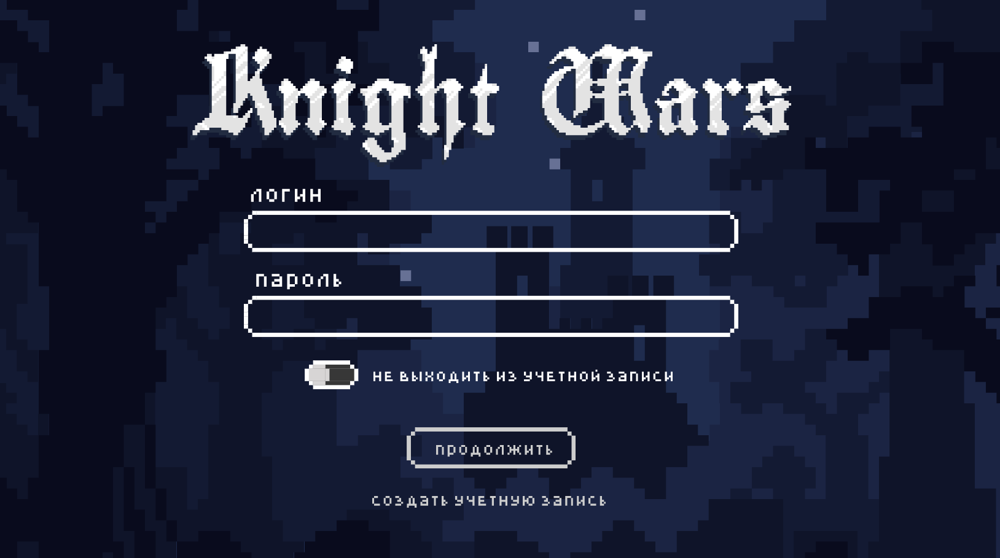

|**Статус**|Не автоматизирован|
|:-----|:---------|
| **Идентификатор** | TC-003 |
| **Приоритет** | Высокий |
| **Название тест-кейса** | Проверка стартового экрана |
| **Указание на модуль тестирования** |4.1. Стартовый экран 4.1.3.1. (наличие всех кнопок)|
| **Исходные данные** | - |
| **Шаги тест-кейса** | 1.Зайти на сайт http://knightwars.local/api  2. Проверить наличие формы авторизации (Логин, Пароль) 3.Проверить наличие кнопки (ползунок, состояние вкл/выкл) «Не выходить из учетной записи»: 4. Проверить наличие Кликабельного текста "Создать учетную запись"|
| **Ожидаемый результат**  | Наличие всех кнопок|
