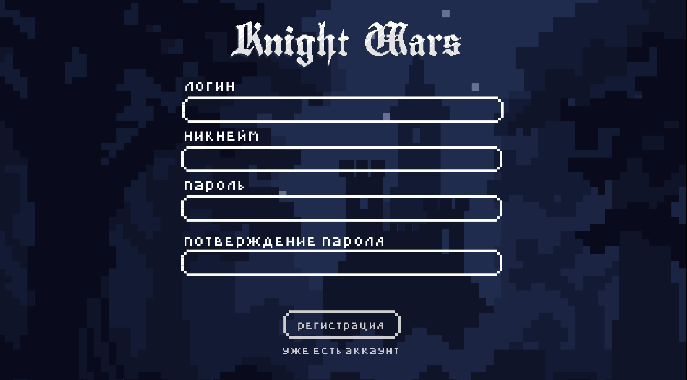

|**Статус**|Не автоматизирован|
|:-----|:---------|
| **Идентификатор** | TC-004 |
| **Приоритет** | Средний |
| **Название тест-кейса** | Проверка наличия всех кнопок на экране регистрации |
| **Указание на модуль тестирования** |4.2 Экран регистрации|
| **Исходные данные** | -  |
| **Шаги тест-кейса** | 1.Зайти на сайт http://knightwars.local/api   2. Нажать на кнопку  "Создать учетную запись"  3.проверить наличие формы регистрации: ( Логин, Никнейм, Пароль, Подтверждение пароля)  4. Проверить наличие кнопки «Регистрация» 5.Проверить наличие  кликабельного текста "Уже есть аккаунт" |
| **Ожидаемый результат** | Наличие всех кнопок  |

